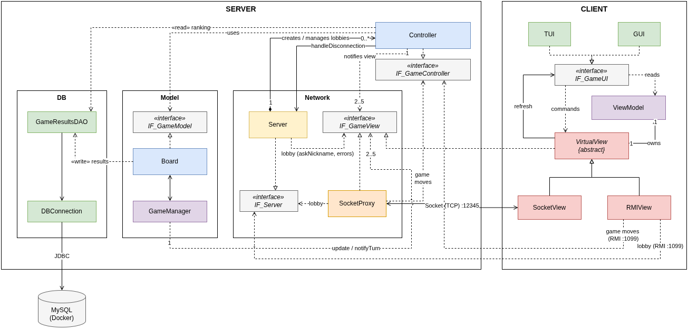
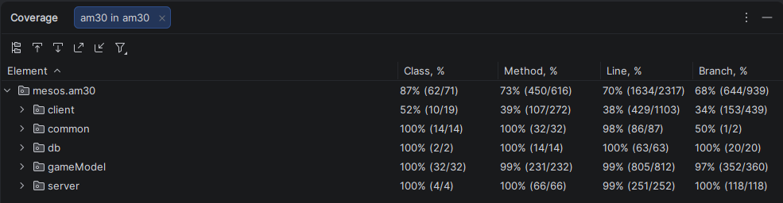

# MESOS - Final Project for Software Engineering
### Academic Year 2025-2026 - Politecnico di Milano

Software implementation of the board game **Mesos**, developed as the Final Project for the Software Engineering course (A.Y. 2025/2026).

The project implements a distributed client-server system that allows 2–5 players to compete online, following the complete game rules.

---

## The Team - AM30

| Name                         | GitHub                                     |
|------------------------------|--------------------------------------------|
| Lorenzo De Simone            | [@LolloDes](https://github.com/LolloDes)   |
| Lorenzo Di Napoli            | [@LoreDN](https://github.com/LoreDN)       |
| Andrea Di Liddo              | [@AndreaDLD](https://github.com/Dilo004)   |
| Enrico Augusto Dogadi Bratti | [@Barattolo](https://github.com/Barattolo) |

---

## Implemented Features

### Core Requirements

| Feature                                 | Implemented |
|-----------------------------------------|:-----------:|
| Complete Rules                          |      ✅      |
| TUI (Terminal User Interface)           |      ✅      |
| GUI (Graphical User Interface - JavaFX) |      ✅      |
| Socket Connection (TCP/IP)              |      ✅      |
| RMI Connection                          |      ✅      |

### Advanced Features (AF)

| Advanced Feature         | Implemented | Notes            |
|--------------------------|:-----------:|------------------|
| Multiple Games           |      ✅      |                  |
| Game Leaderboard on DB   |      ✅      | MySQL via Docker |
| Persistence              |      ❌      |                  |
| Disconnection Resilience |      ❌      |                  |

---

## Documentation

| Resource                                                                                      |
|-----------------------------------------------------------------------------------------------|
| [Complete Class Diagram (detailed)](deliveries/Class-Diagram_am30_detailed.png)               |
| [Complete Class Diagram (class names only)](deliveries/Class-Diagram_am30_ClassNames.png)     |
| [Client Class Diagram](deliveries/Class-Diagram_client.png)                                   |
| [Common Class Diagram](deliveries/Class-Diagram_common.png)                                   |
| [DB Class Diagram](deliveries/Class-Diagram_db.png)                                           |
| [GameModel Class Diagram](deliveries/Class-Diagram_gameModel.png)                             |
| [Server Class Diagram](deliveries/Class-Diagram_server.png)                                   |
| [Connection Sequence Diagram](deliveries/Sequence-Diagram_Connection.png)                     |
| [Model View Controller Sequence Diagram](deliveries/Sequence-Diagram_ModelViewController.png) |

---

## Architecture

The project follows the **Model-View-Controller (MVC)** pattern in a distributed client-server system.



See also the class and sequence diagrams in the [Documentation](#documentation) section.

**Supported network protocols:**
- **Socket** - serialized asynchronous communication (Java Serialization) on port 12345
- **RMI** - remote method invocation on port 1099

Players can freely choose which protocol to use; mixed Socket/RMI games are supported.

**Advanced Feature - Multiple Games:**  
The server manages multiple concurrent games through a lobby system with 6-digit codes. Upon connecting, a player can create a new lobby or join an existing one.

---

## Project Structure

```
src/
+-- main/java/mesos/am30/
|   +-- client/           # ClientMain, Tui, Gui, GamePhase, IF_GameUI
|   |   +-- gui/          # JavaFX Controllers (FXML)
|   |   +-- view/         # VirtualView, SocketView, RMIView, ViewModel
|   +-- common/           # Shared between client and server
|   |   +-- enumerations/ # Choice, ErrorType, MessageType, Move, ViewParameter
|   |   +-- interfaces/   # Shared interfaces (IF_Server, IF_GameController, IF_GameView, IORunnable)
|   |   +-- messages/     # Network messages (Message + subclasses)
|   +-- db/               # DBConnection, GameResultsDAO
|   +-- gameModel/        # Game logic (Model)
|   |   +-- board/        # Board, GameManager, Utility, EventDeserializer
|   |   +-- card/         # Card, CharacterCard, BuildingCard, EventCard, Tile
|   |   +-- event/        # 13 event implementations
|   +-- server/           # Controller, Server, SocketProxy
+-- test/java/mesos/am30/
    +-- client/           # TUI, SocketView, RMIView, VirtualView tests
    +-- db/               # DBConnection, GameResultsDAO tests
    +-- gameModel/        # Board, Player, Card, 13 event tests
    +-- server/           # Controller, Server, SocketProxy tests
```

---

## System Requirements

- **Java**: 25
- **Maven**: 3.8+
- **Docker**: required for the leaderboard feature (MySQL database)

---

## Build

```bash
mvn package
```

Two JARs are produced in the `target/` folder:
- `am30-server.jar` - standalone server
- `am30-client.jar` - standalone client

---

## Running

> **Prerequisite:** if you want to use the leaderboard feature, start the database first (see the [Database](#database) section) before launching the server.

### Server
```bash
java -jar am30-server.jar <server-ip>
```

### Client
```bash
java -jar am30-client.jar <server-ip> <tui|gui> <socket|rmi>
```

**Examples:**
```bash
# Local server
java -jar am30-server.jar 127.0.0.1

# TUI client via Socket
java -jar am30-client.jar 127.0.0.1 tui socket

# GUI client via RMI
java -jar am30-client.jar 127.0.0.1 gui rmi
```

---

## Database

The leaderboard feature requires a MySQL instance started via Docker.

### Configuration

Create the file `db/.env` (not included in the repository) with the database credentials:

```
MYSQL_ROOT_PASSWORD=<root-password>
MYSQL_DATABASE=<database-name>
MYSQL_USER=<user>
MYSQL_PASSWORD=<user-password>
```

### Startup

```bash
cd db
docker compose up -d
```

The container automatically creates the schema and inserts initial data via the scripts in `db/init/`.
The server must be launched from the project root so it can read `db/.env`.

### Schema

The database contains two tables:
- `GAMES` - one row per completed game (date, number of players)
- `RESULTS` - each player's results for each game (nickname, score)

---

## Tests

```bash
mvn test
```

The project includes **32 test classes** covering:
- Game logic (Board, Player, GameManager)
- All 13 building card events
- Network layer (SocketView, SocketProxy, RMIView, VirtualView)
- Controller and server lobby management
- Database layer (DBConnection, GameResultsDAO)
- TUI interface

Frameworks used: **JUnit 5** and **Mockito**.

---

## Coverage

Test coverage measured with the IntelliJ IDEA coverage runner:



---

## Tools Used

| Tool              | Version |
|-------------------|---------|
| Java              | 25      |
| JavaFX            | 21.0.6  |
| Maven             | 3.8+    |
| JUnit             | 5.12.1  |
| Mockito           | 5.23.0  |
| GSON              | 2.10.1  |
| MySQL Connector/J | 9.7.0   |
| H2 (test DB)      | 2.2.224 |
| IntelliJ IDEA     | -       |
| SceneBuilder      | -       |
| Git / GitHub      | -       |

# Copyright

### ITA
Il Gioco da tavolo **Mesos** e tutto il relativo materiale grafico è di esclusiva proprietà di **Cranio Creations**.

### ENG
The **Mesos** Board Game and all related graphics are the exclusive property of **Cranio Creations**.